# AS-Incident-Spiderfoot-Scan

Author: Accelerynt

For any technical questions, please contact info@accelerynt.com  

    

This playbook is intended to be run from a Microsoft Sentinel incident. It will pull email addresses from the account entities in an incident and use them as targets in a Spiderfoot scan. By default, the scan is created using the HaveIBeenPwned module. The resulting report of that scan will be emailed to a recipient of your choosing.

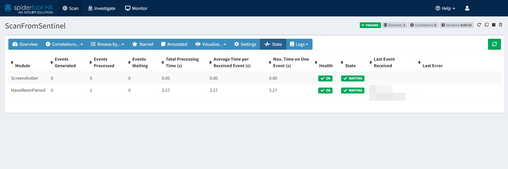

#
### Requirements

The following items are required under the template settings during deployment: 

* The unique subdomain of your Spiderfoot account
* Your Spiderfoot API key
* The email address you would like to have the completed Spiderfoot report link sent to

# 
### Setup

#### Spiderfoot Subdomain
 
Navigate to https://login.hx.spiderfoot.net/signin and sign into your Spiderfoot account.

Take note of your unique subdomain, as it is needed to make API calls. This would be "**example**" in "**example.hx.spiderfoot.net**".

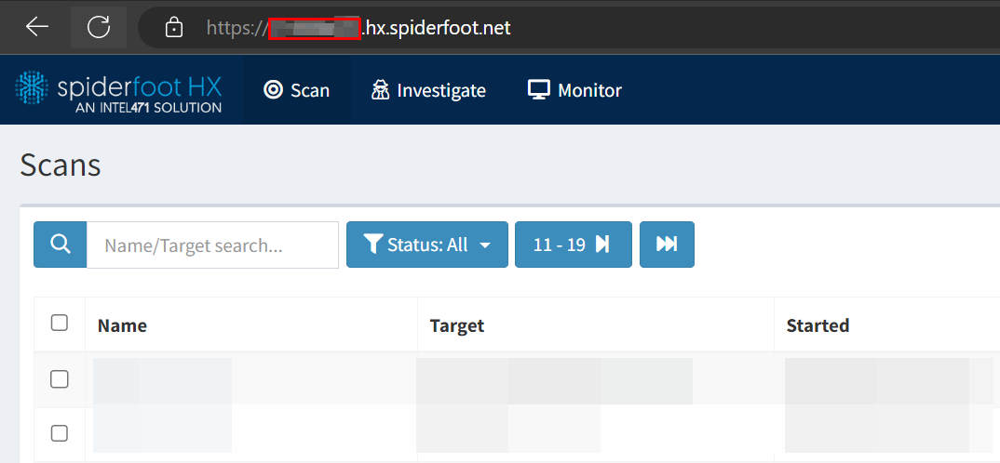

#### Spiderfoot API Key
 
 From your authenticated Spiderfoot session, navigate to the top right-hand corner under your name and click the "**API Key**" option.
 
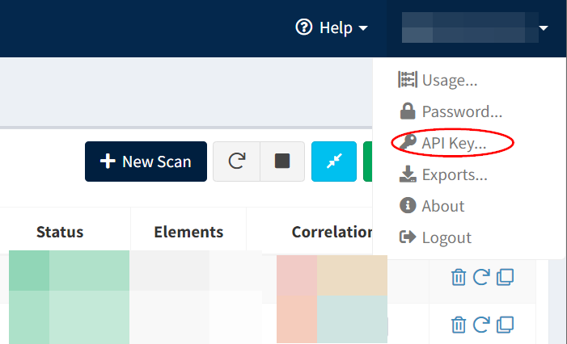

This will generate an API key. Take note of the value, as it will be needed for deployment.

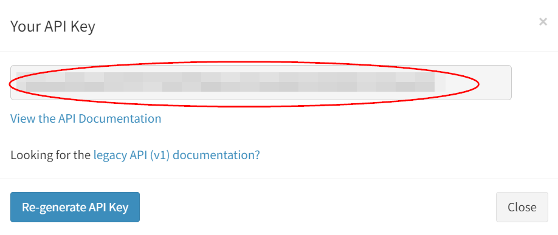

#### Create an Azure Key Vault Secret:

Navigate to the Azure Key Vaults page: https://portal.azure.com/#view/HubsExtension/BrowseResource/resourceType/Microsoft.KeyVault%2Fvaults

Navigate to an existing Key Vault or create a new one. From the Key Vault overview page, click the "**Secrets**" menu option, found under the "**Settings**" section. Click "**Generate/Import**".

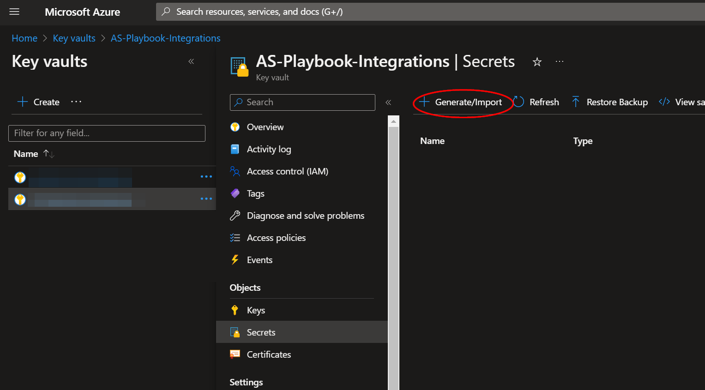

Choose a name for the secret, such as "**AS-Incident-Spiderfoot-Scan**", and enter the Spiderfoot API key copied previously in the [previous section](https://github.com/Accelerynt-Security/AS-Incident-Spiderfoot-Scan#spiderfoot-api-key). All other settings can be left as is. Click "**Create**". 

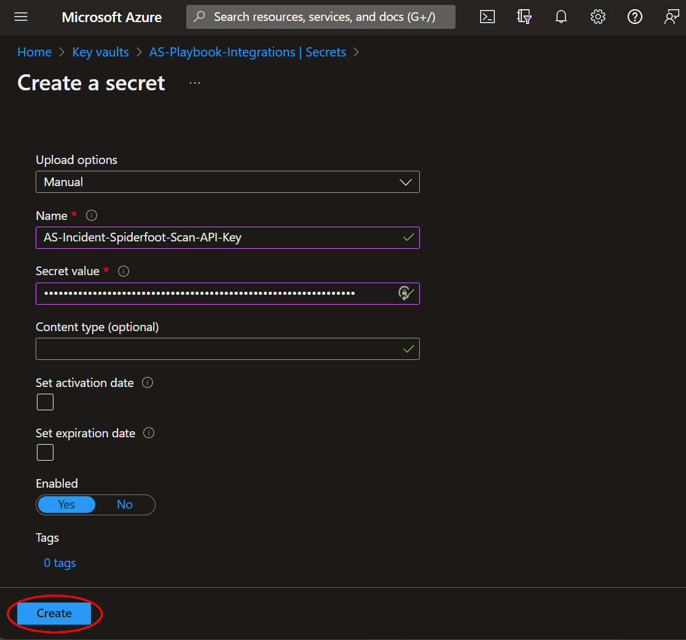

Once your secret has been added to the vault, navigate to the "**Access policies**" menu option, also found under the "**Settings**" section on the Key Vault page menu. Leave this page open, as you will need to return to it once the playbook has been deployed. See [Granting Access to Azure Key Vault](https://github.com/Accelerynt-Security/AS-Incident-Spiderfoot-Scan#granting-access-to-azure-key-vault).

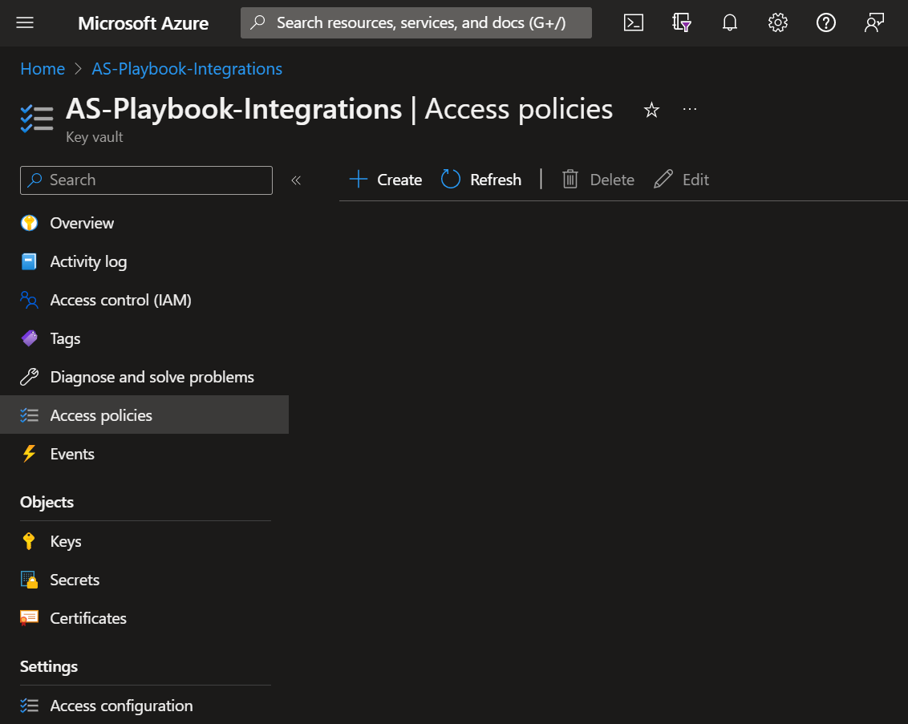

#
### Deployment

To configure and deploy this playbook:
 
Open your browser and ensure you are logged into your Microsoft Sentinel workspace. In a separate tab, open the link to our playbook on the Accelerynt Security GitHub Repository:

https://github.com/Accelerynt-Security/AS-Incident-Spiderfoot-Scan

                                           

From there, click the "**Deploy to Azure**" button at the bottom and it will bring you to the Custom Deployment Template.

In the first section:  

* Select the "**Subscription**" and "**Resource Group**" from the dropdown boxes you would like the playbook deployed to.  

In the **Parameters** section:   

* **Playbook Name**: This can be left as "**AS-Incident-Spiderfoot-Scan**" or you may change it.  

* **Spiderfoot Subdomain**: Enter the name of the unique subdomain referenced in [Spiderfoot Subdomain](https://github.com/Accelerynt-Security/AS-Incident-Spiderfoot-Scan#spiderfoot-subdomain). You do not need to include "https://".

* **Key Vault Name**: Enter the name of the Key Vault referenced in [Create an Azure Key Vault Secret](https://github.com/Accelerynt-Security/AS-Incident-Spiderfoot-Scan#create-an-azure-key-vault-secret).

* **Secret Name**: Enter the name of the Key Vault Secret created in [Create an Azure Key Vault Secret](https://github.com/Accelerynt-Security/AS-Incident-Spiderfoot-Scan#create-an-azure-key-vault-secret).

* **Email Addresses**:  Enter the desired email addresses here. If entering more than one, separate with a semicolon.

Towards the bottom, click on "**Review + create**". 

![Spiderfoot_Deploy_1]](Images/Spiderfoot_Deploy_1.png)

Once the resources have validated, click on "**Create**".

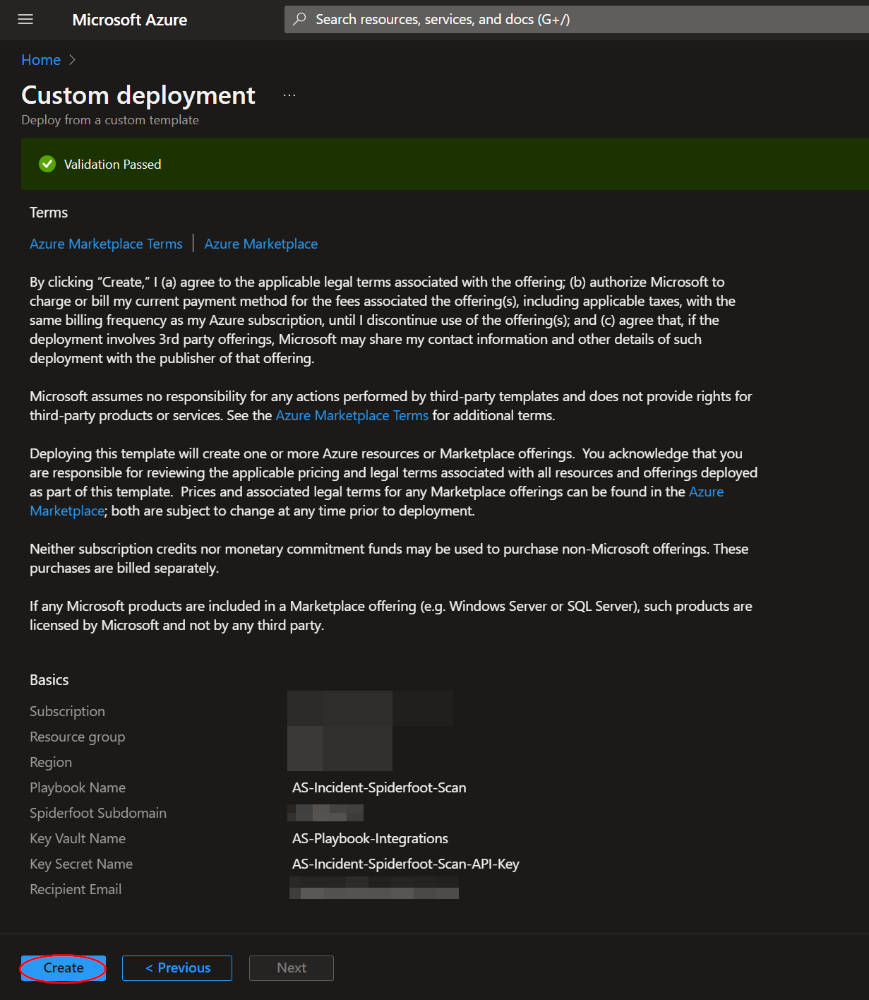

The resources should take around a minute to deploy. Once the deployment is complete, you can expand the "**Deployment details**" section to view them.
To view the deployed Logic App, click the resource that corresponds to it.

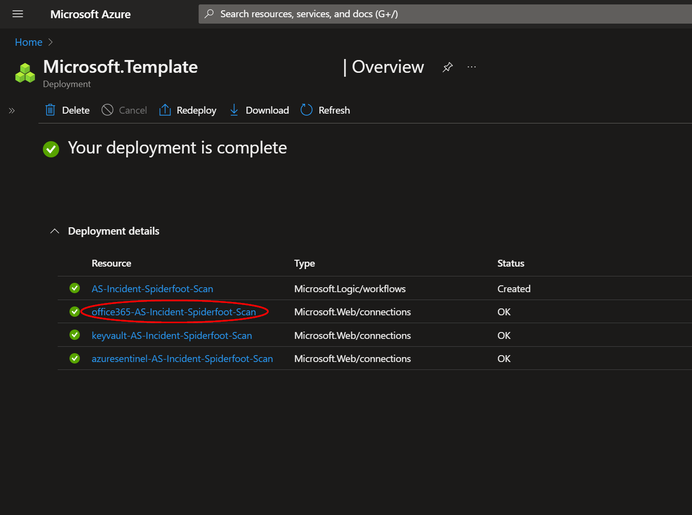

#
### Granting Access to Azure Key Vault

Before the Logic App can run successfully, the Key Vault connection created during deployment must be granted access to the Key Vault storing your Spiderfoot API key.

From the Key Vault "**Access policies**" page, click "**Create**".

Select the "**Get**" checkbox under "**Secret permissions**", then click "**Next**".

Paste "**AS-Incident-Spiderfoot-Scan**" into the principal search box and click the option that appears. Click "**Next**" towards the bottom of the page.

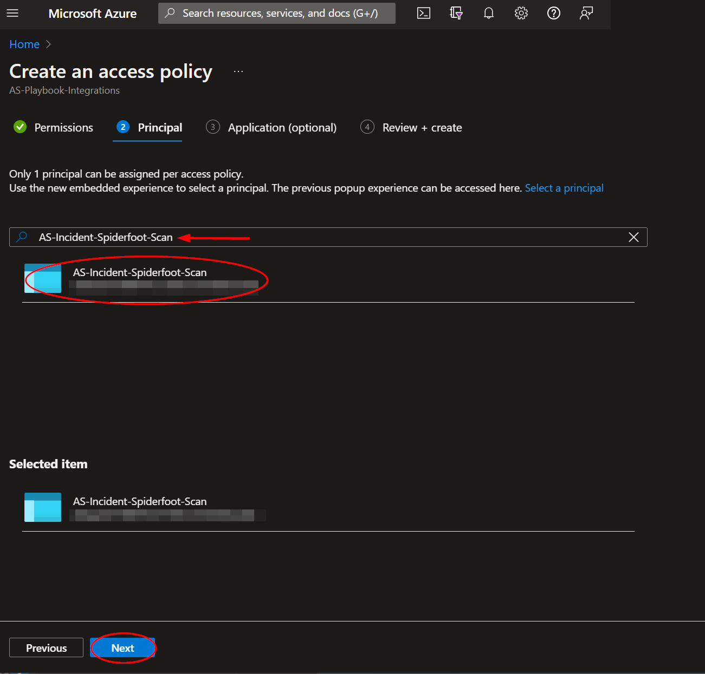

Navigate to the "**Review + create**" section and click "**Create**".

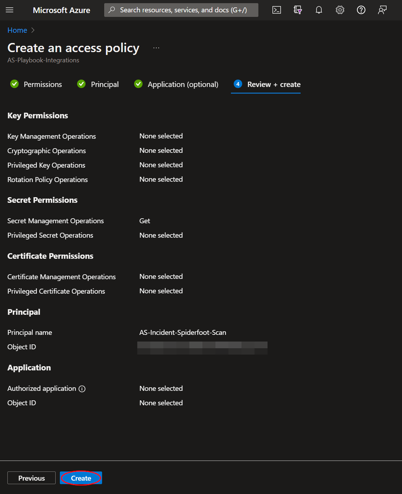

#
### Running the Playbook

To run this playbook on an incident in Microsoft Sentinel, navigate to https://portal.azure.com/#view/HubsExtension/BrowseResource/resourceType/microsoft.securityinsightsarg%2Fsentinel

Select a workspace, then click on "**Incidents**" in the left menu blade, located under "**Threat Management**".

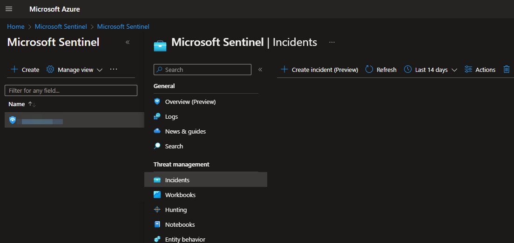

From there you can select an incident that has one or more account entities.

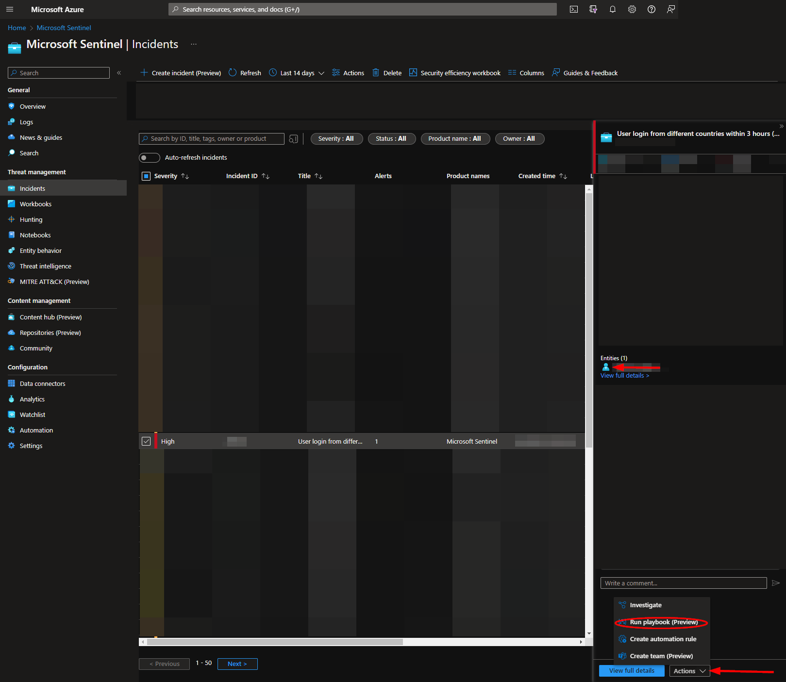

Click the "**Actions**" dropdown button in the bottom right-hand corner. Then click "**Run playbook**".

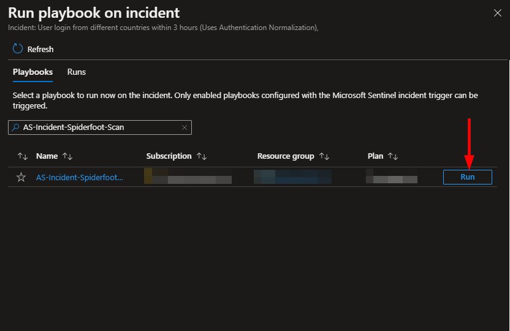

Enter "**AS-Incident-Spiderfoot-Scan**" into the search bar, then click "**Run**".

The playbook will run until the Spiderfoot scan it initiates is completed. Once the scan is finished, an email will be sent to the addresses specified in the deployment parameters. The email will contain the account entities pulled from the incident, the modules used in the Spiderfoot scan, and a link to the completed Spiderfoot report.
